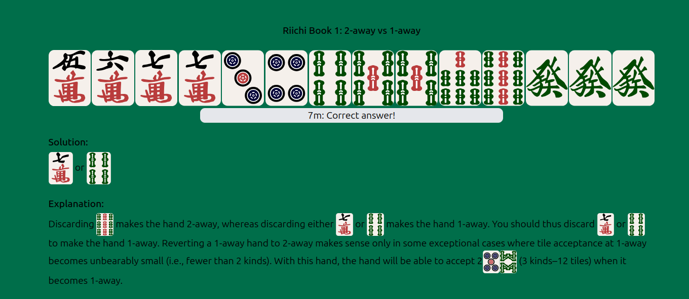

Ruby version: 3.3.8

Dependencies (ubuntu):
```shell
sudo apt update
sudo apt install -y pkg-config libsqlite3-dev build-essential
sudo apt install chromium-driver
```

Run locally: `bundle install` then `bin/dev`

Tests: `bin/rails test:all`

Tile graphics: [FluffyStuff/riichi-mahjong-tiles](https://github.com/FluffyStuff/riichi-mahjong-tiles)